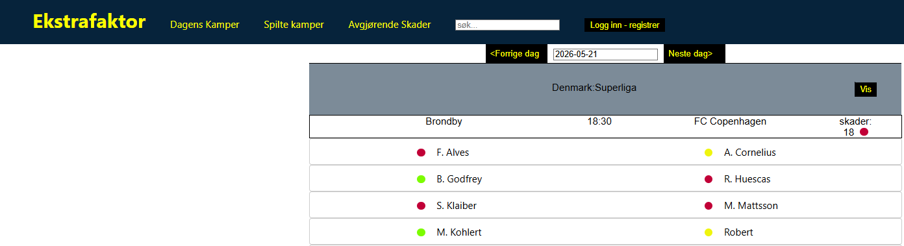

# Ekstrafaktor_match_bet

##Beskrivelse med bilder for hver side av appen
Alle kamper ut ifra dagensdato blir listet opp her som har skade info per liga fra API leverandøren. Altså dagens kamper representerer uspilte kamper. Det er også mulig å navigere seg frem og tilbake for historiske resultater samtidig å se skade status tilbake i tid. For å se de historiske kampene bli listet opp gjøres det ved trykke på spilte kamper øverst i navbar-en.

##Installasjon
1. Hent ut filene fra repo

2. Start server fra cors-proxy/server.js med node.js for unngå cors-policy feil

3. Dagens kamper er hovedsiden der du ser kampstatus for hver kamp når det kommer til skadesituasjon for hver kamp
   Rød betyr kritisk mange viktige skadede spillere ute for den bestemte kampen, gul betyr litt kritisk og grønn ikke kritisk.

For tiden jobber jeg med en mer detaljert info tabell for skadede spillere på en bestemt dato der man skal se info som skadet dato, skadevarighet i dager og innvirkningsstatus.
API kan kun innhente informasjon på 7500 utrekk per dag, og maks 300 utrekk per minutt(5 utrekk per sekund). Dette får konsekvenser når applikasjonen skal beregne skadestatus per kamp når man trykker på Vis knappen per liga.
