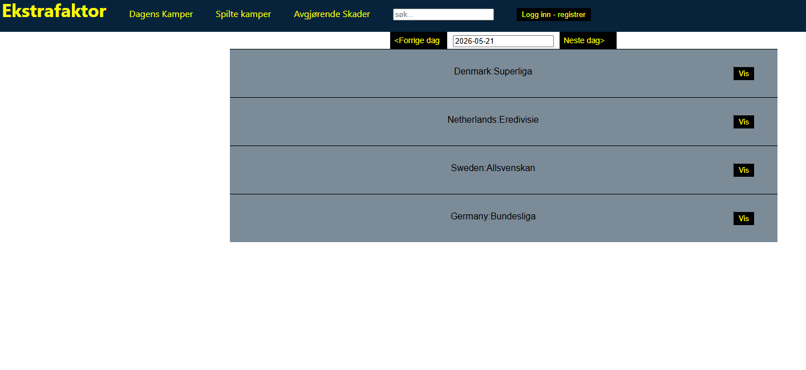
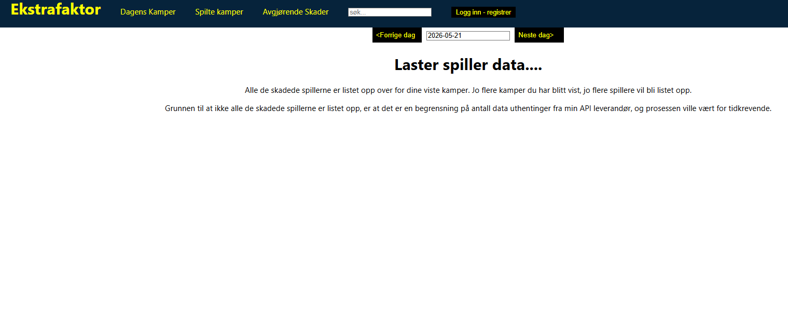
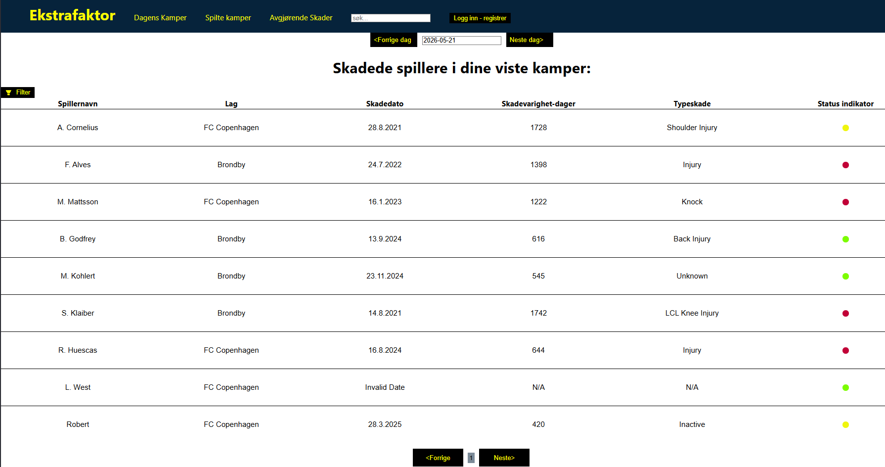
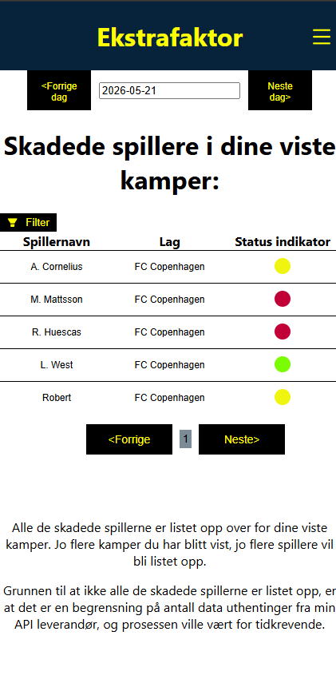
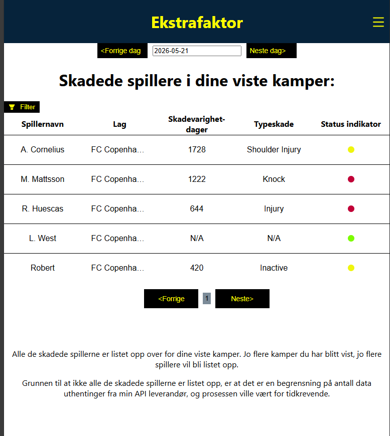

# Ekstrafaktor_match_bet

## Beskrivelse med bilder for hver side av appen
Alle kamper ut ifra dagensdato blir listet opp her som har skade info per liga fra API leverandøren. Altså dagens kamper representerer uspilte kamper. Det er også mulig å navigere seg frem og tilbake for historiske resultater samtidig å se skade status tilbake i tid. For å se de historiske kampene bli listet opp gjøres det ved trykke på spilte kamper øverst i navbar-en.

Slik ser det ut når du trykker på en vis knapp fra en liga ser du total antall skader for hver bestemte kamp. Status indikatoren indikerer om det har en stor innvirkning på kampen basert hvor mange VIKTIGE fotballspillere som ikke skal spille den bestemte kampen. De alternative fargene kan bli grønn, gul og rød. Der grønn betyr ingen innvirkning på kampen, gul står for det kan være, og rødt betyr at det er spillerne som er ute har garantert en stor innvirkning på kampen.
[mangler bildet]

Trykker man på den fargede sirkelen blir de spesifikke spillerne listet opp på hver sin side under hvert sitt lag de er representert i. Da er det mulig å se hvilke spesifikke spillere det gjelder, og hvor stor virkning hver spesifikke fotballspiller er for kampen.

På avgjørende skader siden viser den ekstra statistikk på fotballspillere som er ut hentet fra ligaene du har trykket vis knappen på forhånd. Helt på toppen til høyre spiller detalj tabellen vises en filter knapp der man kan filtrere på kriteriene: ligaer, type skade, og fotball lag. Nederst ser man pagenering der man kan navigere mellom sidene ved hjelp av knappene forrige og neste. Som skal være forbyggende mot nedover scrolling.
Først må man vente litt på lasting av spiller data:

Så kommer alle de aktuelle spillerne opp med detaljert statistikk:

Etter man har trykket på filter knappen:
[mangler bildet]

I søk vinduet kan man søke på lagnavn som vises i bestemt turnering de spiller i når du befinner deg i Dagens kamper eller spilte kamper. På avgjørende skader er etternavnene spillerne søkbare.

Ellers er prosjektet tilpasset dynamisk visning for både smattelefon- og tabletvisning(se bildene nedover her).

### Smarttelefon

###Tablet

## Installasjon
1. Hent ut filene fra repo

2. Start server fra cors-proxy/server.js med node.js for unngå cors-policy feil

3. Dagens kamper er hovedsiden der du ser kampstatus for hver kamp når det kommer til skadesituasjon for hver kamp
   Rød betyr kritisk mange viktige skadede spillere ute for den bestemte kampen, gul betyr litt kritisk og grønn ikke kritisk.

For tiden jobber jeg med en mer detaljert info tabell for skadede spillere på en bestemt dato der man skal se info som skadet dato, skadevarighet i dager og innvirkningsstatus.
API kan kun innhente informasjon på 7500 utrekk per dag, og maks 300 utrekk per minutt(5 utrekk per sekund). Dette får konsekvenser når applikasjonen skal beregne skadestatus per kamp når man trykker på Vis knappen per liga.
